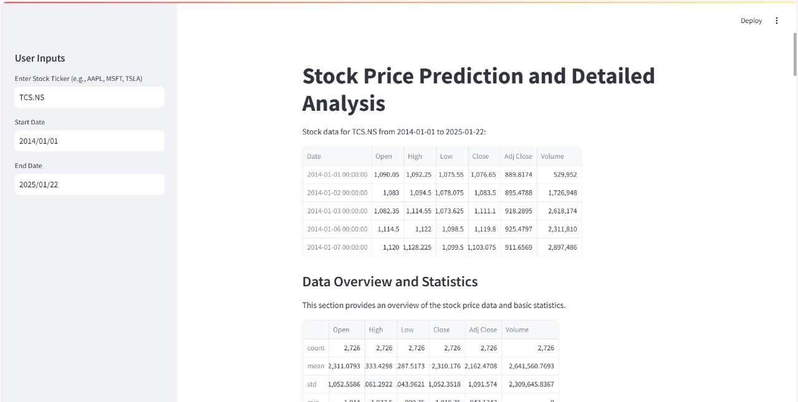
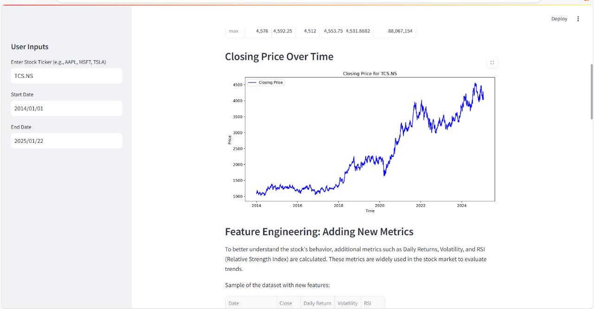
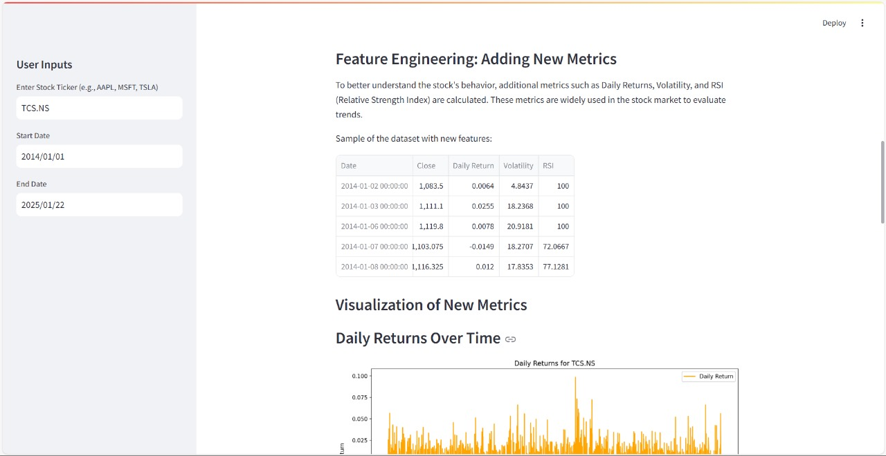
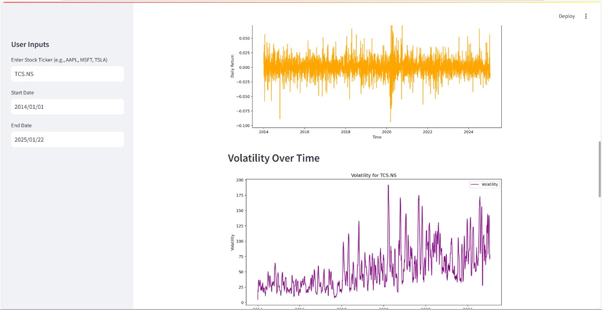
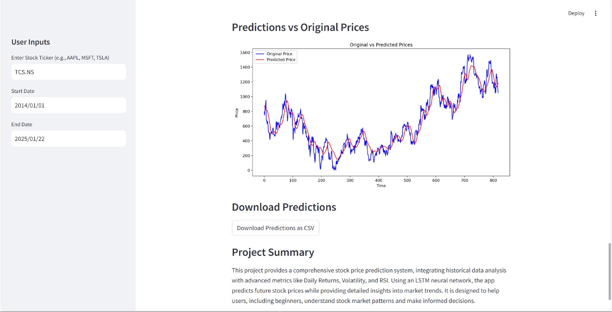

# Stock Price Prediction (LSTM + Streamlit)

A complete stock prediction + analysis app with LSTM, real-time data, technical indicators & recommendation engine.

# 📈 Stock Price Prediction App (LSTM + Streamlit)

A real-time stock analysis tool with:
- LSTM model (Keras / TensorFlow)
- 10+ years historical data
- Technical indicators: SMA, MACD, RSI, Bollinger Bands, Volatility
- Interactive UI with Streamlit
- RSI, Volatility, Daily Returns
- Live data fetch via `yfinance`
- LSTM price prediction
- Buy / Hold / Avoid recommendation
- CSV download support

## ⚙️ Features

- Fetch historical + live stock price data  
- Plot price + technical indicators + predicted future price  
- Option to download predictions  
- Clean, simple UI — ideal for finance-analysis and demo  
- Real-time stock data (Yahoo Finance)
- Custom date range (up to 10 years)
- Technical indicators: SMA, RSI, Volatility
- LSTM deep learning prediction model
- Buy / Hold / Avoid recommendation
- Download predictions as CSV

## 📥 Installation & Setup

```bash
git clone https://github.com/satyamss07/stock-price-prediction.git
cd stock-price-prediction
python -m venv venv
# Windows
venv\Scripts\activate
# Linux/macOS
source venv/bin/activate
pip install -r requirements.txt

```

## Screenshots\n\n\n\n\n\n\n\n\n\n\n\n\n\n\n\n ## Tech Stack - Python - Streamlit - TensorFlow - Pandas / NumPy - Plotly / Matplotlib ## License MIT License
